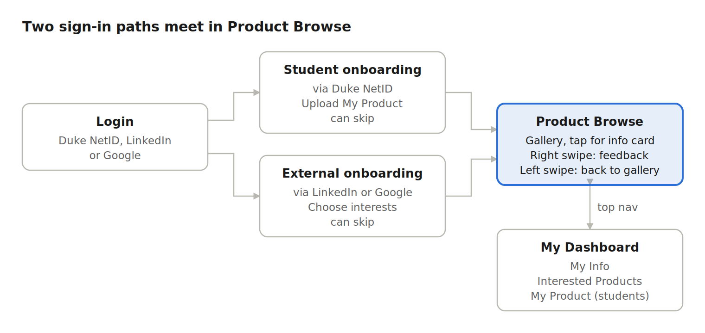

# CFCI in Your Pocket: MVP PRD

> Source of truth: [Google Doc](https://docs.google.com/document/d/1oPbrmdl36o1FETvc4j-tzHx6R3ZfYMdGBdYj-RQcYE0/edit). This is a copy for AI coding tools; if the two differ, the Google Doc wins. Copied 2026-10-04.

## 1. Background

### Current state: why build this
- CFCI needs an external-facing platform to showcase the live student products it supports; today it has no visible, up-to-date portfolio for alumni and investors.
- CFCI has no signal for which products alumni and investors care about, so funding and market attention are not guided by outside interest.
- Last semester's direction (people pitching ideas, matching talent) no longer fits CFCI's needs. The project now restarts around products.

### Core problem: what to build
A portfolio app where Duke student teams list live, relatively mature products, and external users browse them one at a time and give quick feedback.

The MVP is a simple interactive demo that runs the core flow across four modules, so we can confirm the style and interaction with CFCI. The engagement mechanism and product filtering mechanism will be adjusted in later versions based on user interviews.

### Target users and scenarios
| User | Role | Scenario |
| --- | --- | --- |
| CFCI | Primary client | Needs an external-facing platform to showcase its portfolio to alumni and investors, use outside interest to guide resource allocation, and review listings |
| Student team | Content provider / End user | Shows their product to outsiders and collects feedback |
| Investor | End user | Scans several products in a few minutes to find promising deal flow |
| Alumni | End user | Spends a few minutes giving back by reacting to student products |

## 2. Value

### Business value for CFCI
Measured after launch; targets to be set with CFCI.

| Metric | What it tells CFCI |
| --- | --- |
| UV: unique logged-in external users | Reach of the portfolio |
| Exposure: browsing data | UV-to-exposure conversion, exposure-to-engagement conversion |
| **Engagement: reactions and comments per product** | **Which products draw outside interest, as input for funding and resources** |
| Retention: external users returning within 7/30 days | User retention |
| Share of listings updated recently | Portfolio freshness |

MVP success: CFCI confirms the style and core flow, and the demo is ready for user interviews and usability tests.

### Value for users
- **Investors:** a fast, curated way to scan Duke deal flow.
- **Alumni:** a low-effort way to support student founders.
- **Student teams:** exposure to outside stakeholders and specific feedback on their product.

## 3. Requirements

### Overview
The MVP demo has four modules: Login, Onboarding, Product Browse and My Dashboard. Login guidance and Onboarding split users into a student path and an external path; both then share Product Browse and My Dashboard.

Each path has an optional onboarding step that users can skip. In Product Browse, only a right swipe opens the feedback screen; a left swipe returns to the gallery.

Priorities:
- **P0** = in the MVP demo
- **P1** = top priority right after the MVP
- **P2** = next version
- **P3** = later exploration

Everything beyond P0 is listed in section 4.

### Module 1: Login
| Requirement | Priority |
| --- | --- |
| Guidance on the login page: Duke students listing a product sign in with Duke NetID; alumni, investors and other users sign in with LinkedIn or Google | P0 |
| Sign in with Duke NetID, LinkedIn or Google | P0 |
| Login required before browsing (needed to count unique users) | P0 |
| Duke NetID sign-in leads to the student path; LinkedIn or Google leads to the external path | P0 |

### Module 2: Onboarding
Shown after first login. Every user can skip it.

| Requirement | Priority |
| --- | --- |
| Students: upload My Product with product name, one-sentence intro, cover image, demo video and product brief | P0 |
| External users: choose interested directions (for example Research, Health, Software, Hardware) | P0 |
| Skip on both paths; a student who skips can upload later from My Dashboard | P0 |
| Interested directions only set the default gallery filter; no matching | P0 |

### Module 3: Product Browse
| Requirement | Priority |
| --- | --- |
| Gallery view: each card shows product name, cover image and one-sentence intro | P0 |
| Tap a card to open a pop-up info card, like a dating app profile; the demo video starts playing, scroll down for more information | P0 |
| Swipe left = not interested: back to the gallery, no feedback asked | P0 |
| Swipe right = interested: product added to Interested Products, then the feedback screen opens | P0 |
| Feedback screen: Would use / Would invest / Would intro someone, plus a comment field | P0 |

### Module 4: My Dashboard
| Requirement | Priority |
| --- | --- |
| My Info: profile, sign-in account, interested directions | P0 |
| Interested Products: products the user swiped right on | P0 |
| My Product (students only): edit the uploaded product | P0 |
| My Product (students only): listing status (Pending review / Live / Archived) | P0 |
| My Product (students only): feedback received (reaction counts, comments) | P0 |

The demo uses sample product data; CFCI approval is simulated by the listing status.

## 4. Risks and open items

### MVP risks
- The demo runs on sample data; real product content may not fit the confirmed design.
- Moving from demo to a production build may require technical rework.
- Requiring login before browsing may stop some external users from trying it.

### Post-MVP items to confirm
| Item | Priority |
| --- | --- |
| User pain point validation: whether external users and students are motivated enough to use it | P1 |
| Engagement mechanism: why external users come and leave feedback; redesign the feedback screen based on interviews | P1 |
| Product filtering: standard product assessment plus risk score, and the bar for listing | P2 |
| CFCI staff end: approval workflow and collaborative editing of listings with teams | P2 |
| Browse enhancements: filter by category or stage, follow a product | P2 |
| Refine product upload fields beyond the MVP set | P2.5 |
| LLM first-round review of submissions and its evaluation metrics | P3 |
| AI-generated product portfolio page: layout and which information to keep | P3 |
| Portfolio freshness: "last updated" prompts, automatic reminder emails, auto-archive | P3 |
| Prefill profile from LinkedIn | P3 |

### Open questions
- [ ] How will CFCI approve listings before a staff end exists?
- [ ] Are reactions and comments visible to other viewers, or only to the student team and CFCI?
- [ ] Which fields must every listing have to meet the high-bar standard?

## 5. Visual style
Clean, card-based and mobile-first, with card interactions similar to a dating app. CFCI has no brand guidelines; the details below will be decided with our designer.

| Item | Decision |
| --- | --- |
| Color palette | Duke-inspired. Primary Navy #001A57 and Royal Blue #00539B. White #FFFFFF and light gray #F7F8FA backgrounds. Dark text #111827, secondary gray #58595B. Green #A1B70D for positive/interest states; yellow #F6C867 and purple #693E71 sparingly for accents. |
| Typography | Modern sans-serif, bold/semibold headings, clean readable body text, strong hierarchy, optimized for mobile. |
| Gallery card layout | Large image-first cards with rounded corners, subtle borders/shadows, product name + one-line pitch. Minimal UI; product is the focus. Swipeable, tactile feel. |
| Info card pop-up | Near-full-screen product profile. Large cover/video hero, product name, one-line pitch, category, description, team/details. Scrollable with clear hierarchy and rounded sections. |
| Motion and swipe animation | Smooth, responsive swipe animations. Card follows finger. Right swipe = positive/interest; left swipe = dismiss. Subtle scale/opacity transitions; avoid excessive gamification. |
| Desktop vs mobile | Mobile-first. One product at a time on mobile. Desktop keeps the focused product-card experience rather than a traditional grid. Dashboard can use wider/two-column layouts. |
| Reference apps | Tinder (swipe interaction), Product Hunt (product discovery), Linear (UI/spacing), Airbnb (image-forward discovery), LinkedIn (professional profiles). |
